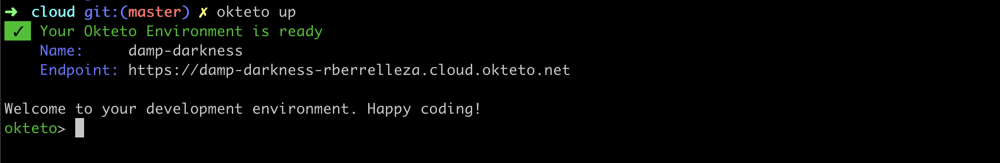

# Math App

This example shows how to leverage [Okteto](https://cloud.okteto.com) to develop a golang app directly in the cloud. 

## Step 1: Install the Okteto CLI

Install the Okteto CLI by running the following command in your local terminal:

MacOS/Linux

```console
curl https://get.okteto.com -sSfL | sudo sh
```

Windows

```console
wget https://downloads.okteto.com/cloud/cli/okteto-Windows-x86_64 -OutFile c:\windows\system32\okteto.exe
```

## Step 2: Login from the Okteto CLI

```console
$ okteto login
```

This will give you an Okteto Space, where you can create Okteto Environments to code and collaborate.

## Step 3: Create your Okteto Environment

Get a local version of the sample application by executing the following commands in your local terminal:

```console
$ git clone https://github.com/okteto/cloud-samples
$ cd cloud-samples/math
```

You now have a functioning git repository that contains a simple golang application. Now start your Okteto Environment by running the following command:

```console
$ okteto up
```

The `okteto up` command will automatically start an Okteto Environment. It will also start a file synchronization service to keep your changes up to date between your local filesystem and your Okteto Environment. 



Once the Okteto Environment is ready, start your application by executing the following command in your Okteto Terminal:

```console
okteto> go run main.go
```

Your application is now ready to be tested. You can check it by browsing the application's endpoint, adding the path `/mult/3/4`. In our case, it would be the endpoint `https://damp-darkness.rberrelleza.cloud.okteto.net/mult/3/4`.

> Note that Okteto creates a public HTTPS endpoint forwarding to the port 8000 of your application.

Congratulations, you just deployed your first Okteto Application 🚀! 

## Step 4: Develop directly in the cloud

Now things get more exciting. Edit the file `math/main.go` and switch the word `mult` by `times` at line 43. Save your changes. Cancel the execution of `go run main.go` from your Okteto Terminal by pressing `ctrl + c`. Run your tests to check that everything is fine with your changes:

```console
okteto> go test ./...
```

And finally rerun your application:

```console
okteto> go run main.go
```

In just seconds, your code changes are live! Check it by accessing the path `/times/3/4` of your application endpoint. No commit or push required 😎!

## Step 5: Deploy your application

Now that you are happy with your changes, it is time to deploy them.

Press `ctrl + c` and `ctrl + d` to go back to your local terminal, and execute:

```console
$ okteto run okteto/math:0.1.0
```

This command replaces your Okteto Environment by a service running `okteto/math:0.1.0`. If you want to use another docker image, your will need to build and push it manually (*note: contact us for private images support*).
