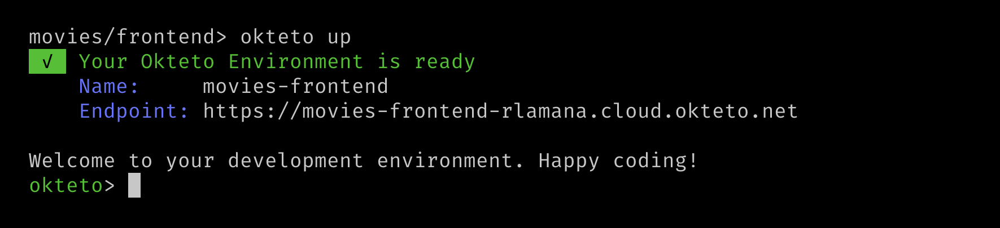
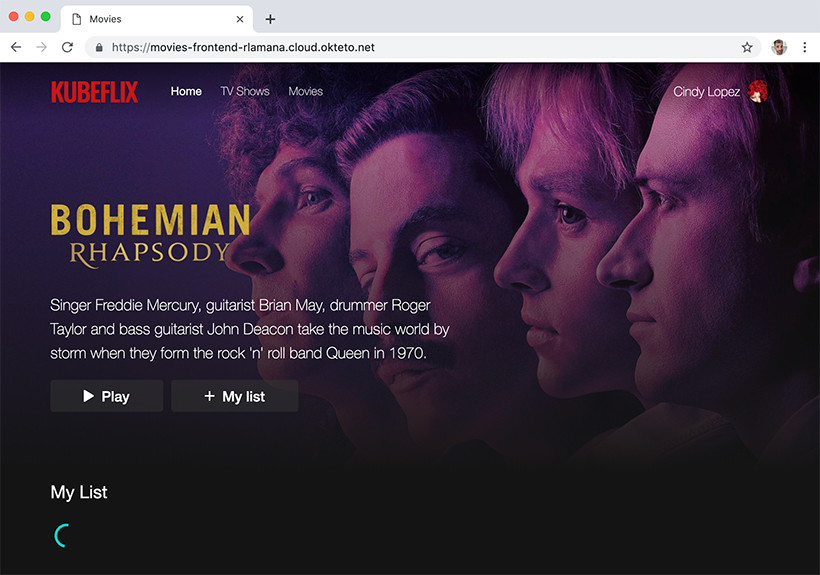
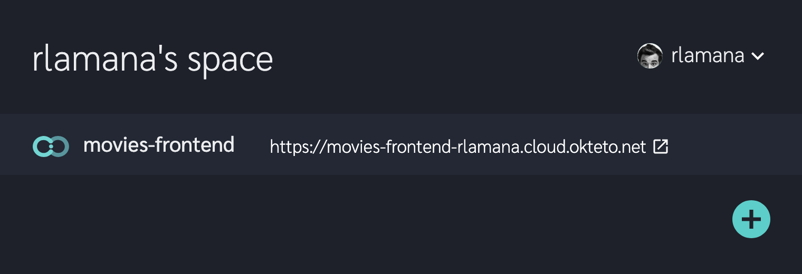
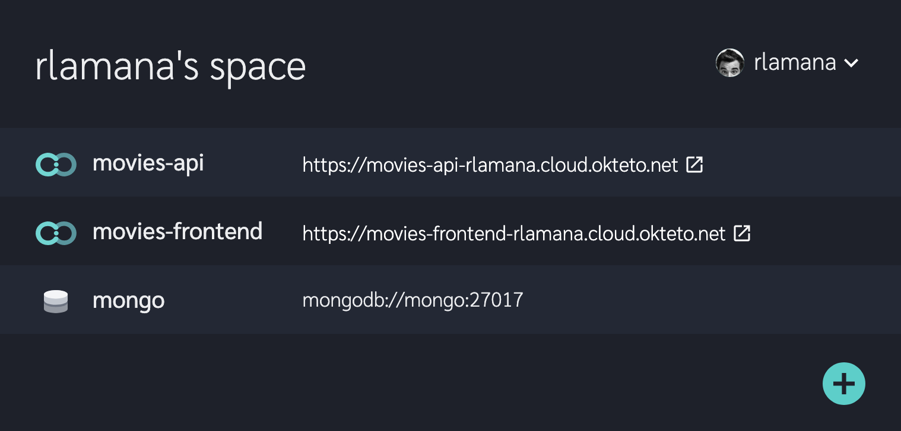
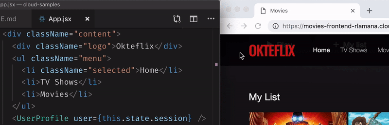

# Movies App

This example shows you how to build a full stack application directly in the cloud using [Okteto](https://cloud.okteto.com). 

The Movies application exposes three services:

- A *React* based front-end, using [webpack](https://webpack.js.org) as bundler and *hot-reload server* for development.
- A very simple Node.js API using [Express](https://expressjs.com).
- A [MongoDB](https://www.mongodb.com) database.

### Step 1: Install the Okteto CLI

Install the Okteto CLI by running:

```console
curl https://get.okteto.com -sSfL | sh
```

if you are in Linux/MacOS, or by running:

```console
wget https://downloads.okteto.com/cloud/cli/okteto-Windows-x86_64 -OutFile c:\windows\system32\okteto.exe
```

if you are in Windows.

### Step 2: Login from the Okteto CLI

```console
$ okteto login
```

This will give you an Okteto Space, where you can create Okteto Environments to code and collaborate.

### Step 3: Create your Okteto Environments

Clone the samples repository:

```console
$ git clone https://github.com/okteto/cloud-samples
```

Now that you have the application code in your local machine, let's create your Okteto Environments to run the application directly in the cluster.

### Step 3.1: Launch front-end environment

Move to the movies front-end code directory:

```console
$ cd cloud-samples/movies/frontend
```

From the frontend's root directory, launch the following command:

```console
$ okteto up
```

The `okteto up` command will automatically start an Okteto Environment. It will also start a *file synchronization service* to keep your changes up to date between your local filesystem and your Okteto Environment, without rebuilding containers (eliminating the docker build/push/pull/redeploy cycle).



Once the Okteto Environment is ready, the Okteto Terminal will automatically open. Use it to run your frontend with the same flow you would have locally:

```console
okteto> yarn start
```

The frontend of your application is now ready to be tested. You can check it by browsing the application's endpoint (see console output). 



You can also check your environments by logging into [Okteto](https://cloud.okteto.com) and clicking on the application’s endpoint:



> Note that Okteto creates a public HTTPS endpoint forwarding to the port 8000 of your application.

### Step 3.2: Launch API environment

You may have noticed that the app is missing information and there are errors in your browser's console. The frontend depends on an API and a database to retrieve the movies data. 

The API uses a MongoDB database. In a **new terminal** run the following command to deploy an Okteto MongoDB database into your Okteto Space:

```console
$ okteto database mongo
```

Now we need the API where the frontend can connect to. From the API source directory run again the Okteto CLI to create a new environment:

```console
$ cd cloud-samples/movies/api
$ okteto up
```

Once you are inside the Okteto Terminal, launch the API express server:

```console
$ yarn start
```

Go back to your browser and refresh the page. You'll see how the front-end is now populated with all the movies information.

Congratulations, you just deployed your first multi-service application using Okteto 🚀! 



### Develop as a Cloud Native Developer

Now things get even more exciting. You can now develop *directly in the cluster*. The API service and database will be available at all times. No need to mock the service nor use any kind of redirection.
 
In your IDE edit the file `frontend/src/App.jsx` and change the `Okteflix` text in line 92 to `Netflix`. Save your changes.

Go back to the browser, and cool! Your changes are automatically live with no need to refresh your browser! Everything happened in the cluster but no commit or push was required 😎!


