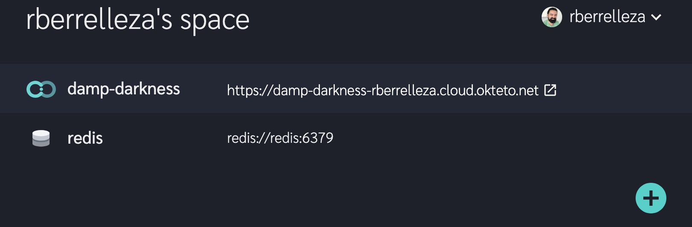

# Voting App

This example shows how to leverage [Okteto](https://cloud.okteto.com) to develop a python app directly in the cloud. 

## Step 1: Install the Okteto CLI

Install the Okteto CLI by running the following command in your local terminal:

MacOS/Linux

```console
curl https://get.okteto.com -sSfL | sudo sh
```

Windows

```console
wget https://downloads.okteto.com/cloud/cli/okteto-Windows-x86_64 -OutFile c:\windows\system32\okteto.exe
```

## Step 2: Login from the Okteto CLI

```console
$ okteto login
```

This command will give you an Okteto Space, where you can create Okteto Environments to code and collaborate.

## Step 3: Create your Okteto Environment

Get a local version of the sample application by executing the following commands in your local terminal:

```console
$ git clone https://github.com/okteto/cloud-samples
$ cd cloud-samples/vote
```

You now have a functioning git repository that contains a simple python 3 application and a `requirements.txt`, which is used by Python’s dependency manager, `pip`.

The sample application uses redis. Run the following command to deploy an Okteto Redis Database into your Okteto Space:

```console
$ okteto database redis
```

Now start your Okteto Environment by running the following command:

```console
$ okteto up
```

The `okteto up` command will automatically start an Okteto Environment. It will also start a file synchronization service to keep your changes up to date between your local filesystem and your Okteto Environment. 


Once the Okteto Environment is ready, start your application by executing the following commands in your Okteto Terminal:

```console
okteto> pip install -r requirements.txt
okteto> python app.py
```

Your application is now ready to be tested. You can check it by logging into [Okteto](https://cloud.okteto.com) and clicking in the application's endpoint.

> Note that Okteto creates a public HTTPS endpoint forwarding to the port 8000 of your application.



Congratulations, you just deployed your first Okteto Application 🚀! 

## Step 4: Develop directly in the cloud

Now things get more exciting. Open `vote/app.py` in your favorite IDE and modify the `getOptions` function with the following code, and save your file:

```python
def getOptions():
    optionA = 'Otters'
    optionB = 'Dogs'
    return optionA, optionB
```

Go back to the Okteto Terminal and notice that flask already detected the code changes and reloaded your application.

```console
...
 * Detected change in '/usr/src/app/app.py', reloading
 * Restarting with stat
 * Debugger is active!
 * Debugger PIN: 778-756-428
```

Go back to the browser, and reload the page. Notice how your changes are instantly applied. No commit or push required 😎! 

## Step 5: Deploy your application

Now that you are happy with your changes, it's time to run your updated application with the `okteto run` command. Instead of launching an Okteto Environment and synchronizing your files, the `okteto run` command automatically deploys a container into your Okteto Space.

Let's build a Docker image with your latest changes. Press `ctrl + c` and `ctrl + d` in your Okteto Terminal to go back to your local terminal, and execute the following command to build your docker image and push it to [Docker Hub](https://docs.docker.com/docker-hub/repos/):

```console
$ docker build -t <hub-user>\vote
$ docker push <hub-user>\vote
```

> If you don't have access to Docker Hub, you can use `okteto/vote:0.1.0` instead of your own docker image to complete this step.

Once your image is ready, run the following command to deploy your container:

```console
$ okteto run <hub-user>\vote
```

After a couple of seconds, your application will be ready. Go back to the browser and reload the page to see your new docker container up and running. 

> `okteto run` only supports images from public docker repositories.[Contact us](mailto:sales@okteto.com?Subject=Support for private images) if you're interested in support for private images
