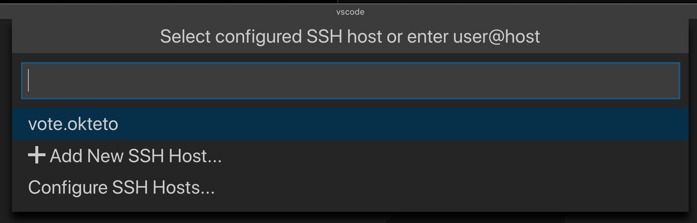
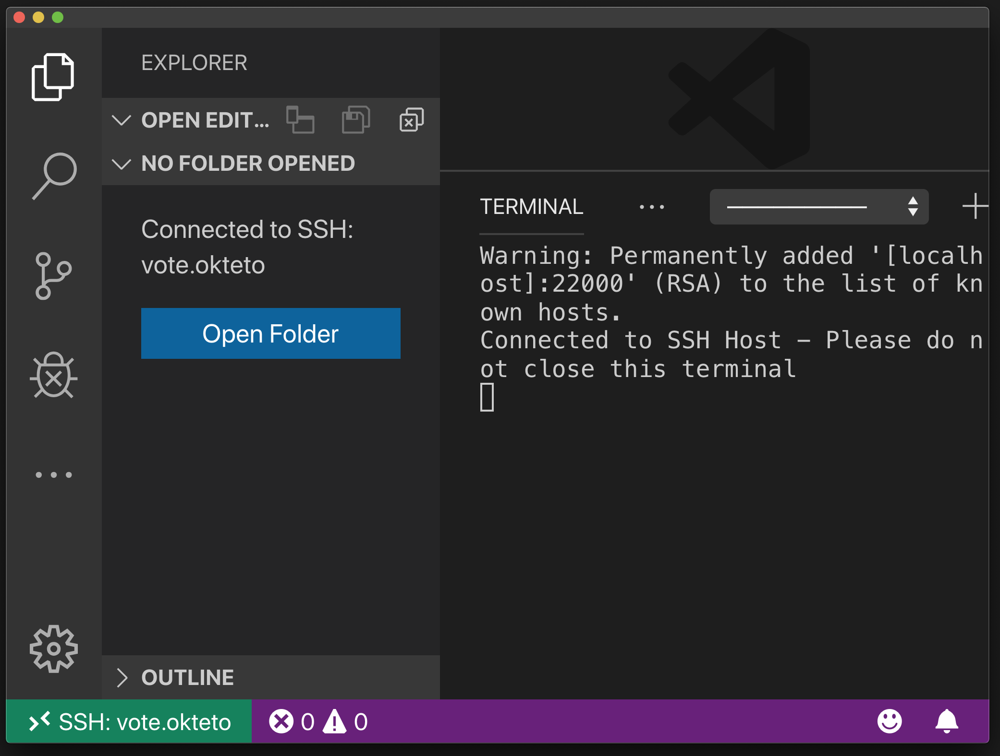

# VS Code Remote Development with Kubernetes

This example shows how to leverage [Okteto](https://github.com/okteto/okteto) to develop a Python Sample App directly in Kubernetes using the Visual Studio Code Remote Development extension. 

> This sample requires Okteto 1.5.0 or newer. 

Okteto works in any Kubernetes cluster by reading your local Kubernetes credentials. If you don't have access to a local cluster, you can follow this [blog post](https://medium.com/okteto/vs-code-remote-development-in-kubernetes-d7eef7cea4fd) to deploy the Python Sample App in [Okteto Cloud](https://cloud.okteto.com), a free managed Kubernetes service designed for developers.

## Step 1: Install the Okteto CLI

Install the Okteto CLI by following our [installation guides](https://github.com/okteto/okteto/blob/master/docs/installation.md).

## Step 2: Deploy the Voting App

Clone this repository and move to this example folder.

```console
$ git clone https://github.com/okteto/samples
$ cd samples/vscode
```

Run the Voting App by executing:

```console
$ kubectl apply -f manifests
```

```console
deployment.apps "vote" created
service "vote" created
```

Wait for a few seconds until the application is running. You can try it by opening your browser and going to http://localhost:8080.

## Step 3: Develop as a Cloud Native Developer

Start your Okteto Environment by running the following command:

```console
$ okteto up --remote 22000
```

```console
 ✓  Okteto Environment activated
 ✓  Files synchronized
 ✓  Your Okteto Environment is ready
    Namespace: pchico83
    Name:      vote
    Forward:   8080 -> 8080
               22000 -> 22001

INFO[0000] bash exists at /bin/bash
INFO[0000] ssh server started
```

The `okteto up` command will automatically start your Okteto Environment. It will also start a file synchronization service to keep your changes up to date between your local filesystem and your Okteto Environment. Last but  not least, it will inject an SSH server listening on port 22000 into the development environment, and add an entry to your `~/.ssh/config` file. This will enable the integration between the development environment in Kubernetes and the VS Code Remote SSH Development extension.

We're ready to start developing on our remote environment. Open VS Code, and run `Remote-SSH: Connect to Host...` from the Command Palette (F1) and select the `vote.okteto` entry.



After a few seconds, VS Code will connect over SSH and configure itself. Once it's finished, you'll be in an empty window. Click on the `Open Folder` button and select `/src`. After a few seconds, the remote folder will be loaded.  



From now on, any actions you perform will happen directly in your Kubernetes development environment. Open a new terminal window in VS Code (Terminal > New Terminal) and run the following command:

```console
$ python app.py
```

```console
 * Serving Flask app "app" (lazy loading)
 * Debug mode: on
 * Running on http://0.0.0.0:8080/ (Press CTRL+C to quit)
 * Restarting with stat
 * Debugger is active!
 * Debugger PIN: 117-959-944
```

This command will start the python service on your Kubernetes development environment. Open your browser and navigate to http://localhost:8080 to see the application.

Now let's make a code change. Open `app.py` in VS Code and modify the `getOptions` function with the code below:

```python
def getOptions():
    optionA = 'Otters'
    optionB = 'Dogs'
    return optionA, optionB
```

Go to the browser again and reload the page. Did you notice that your changes were applied instantly? No commit, build or push required. And what is even more awesome, is that you can now enjoy all the VS Code features and extensions, but with the added benefit that you're running your development environment in Kubernetes  😎!

> We recommend to keep Git extensions locally. This way they use your local keys and you don´t need to install them remotely.

## Step 4: Cleanup

Close the remote VS Code instance, and then cancel the `okteto up` command by pressing `ctrl + c` and run the following commands to remove the resources created by this guide: 

```console
$ okteto down -v
```

```console
 ✓  Okteto Environment deactivated
```

```console
$ kubectl delete -f manifests
```

```console
deployment.apps "vote" deleted
service "vote" deleted
```
